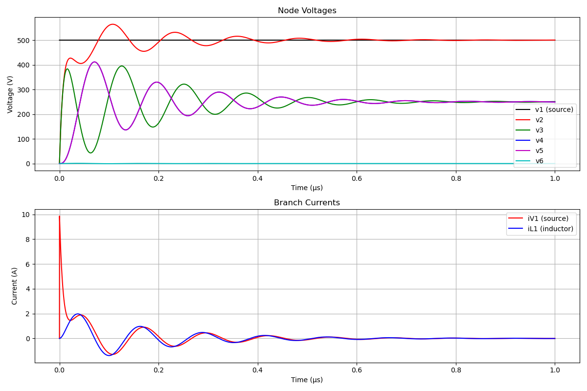

# PlasmaSpice: Python Circuit Simulation Program

A Python-based circuit simulation program that implements both Modified Nodal Analysis (MNA) for DC analysis and Differential Algebraic Equations (DAE) for transient analysis.

## Overview

PlasmaSpice is a circuit simulation tool that can handle both DC and transient analysis of electronic circuits. It uses MNA for DC analysis and DAE for transient analysis, with support for various circuit elements.

## Features

### Analysis Methods

- DC Analysis using Modified Nodal Analysis (MNA)
- Transient Analysis using Differential Algebraic Equations (DAE)
- Automatic matrix construction for both analysis types

### Supported Circuit Elements

- Resistors (R)
- Capacitors (C)
- Inductors (L)
- Voltage Sources (V)
- Current Sources (I)

### Matrix Systems

1. DC Analysis (MNA):

```
[G B] [v] = [i]
[C D] [j]   [e]
```

2. Transient Analysis (DAE):

```
A * dx/dt = B * x + C
```

### Advanced Features

- Automatic identification of algebraic and differential variables
- Consistent initial condition calculation through DC analysis
- Variable step-size integration using IDA solver
- Robust numerical solver with configurable tolerances

## Project Structure

```
plasmaSpice/
├── __init__.py
├── core/
│   ├── __init__.py
│   ├── circuit.py      # Main circuit class
│   ├── elements.py     # Circuit elements
│   └── dae_solver.py   # DAE solver implementation
│
tests/
├── test_dae_solver.py          # DAE solver tests
├── test_dae_system.py          # DAE system tests
├── test_elements.py            # Component tests
├── test_voltage_divider.py     # Basic circuit tests
└── test_outputs/              # Simulation results
    ├── auto_dae_solution.txt
    ├── solution_data.txt
    ├── solution_data_example.txt
    └── *.png                  # Response plots
```

## Implementation Details

### Circuit Element Stamping

Each circuit element contributes to the system matrices through its `stamp` (DC) and `stamp_dae` (transient) methods:

```python
class Component:
    def stamp(self, matrix, vector, node_map, vsrc_map):
        """Contribute to MNA matrix for DC analysis"""
        pass

    def stamp_dae(self, A, B, C, node_map, vsrc_map):
        """Contribute to DAE system matrices for transient analysis"""
        pass
```

### DAE System Construction

The state vector is organized as:

```
x = [v1,...,vn, iV1,...,iVm, iL1,...,iLk]
```

where:

- v1 to vn: node voltages
- iV1 to iVm: voltage source currents
- iL1 to iLk: inductor currents

### Solver Configuration

The DAE solver supports various configuration options:

```python
solver = DAESolver({
    'atol': 1e-6,          # Absolute tolerance
    'rtol': 1e-3,          # Relative tolerance
    'maxsteps': 10000,     # Maximum steps
    'inith': 1e-14,        # Initial step size
    'suppress_alg': True,  # Suppress algebraic warnings
    'algvar': algvar_list  # Variable type indicators
})
```

## Usage Example

```python
from plasmaSpice.core import Circuit
from plasmaSpice.core.elements import VoltageSource, Resistor, Capacitor, Inductor

# Create circuit
ckt = Circuit()

# Add elements
ckt.add_element(VoltageSource("V1", 1, 0, 500.0))
ckt.add_element(Resistor("R1", 1, 2, 50))
ckt.add_element(Capacitor("Cm1", 2, 0, 1.5e-10))
ckt.add_element(Capacitor("Cm2", 2, 3, 2e-10))
ckt.add_element(Inductor("Lm", 3, 4, 4.3e-6))

# DC analysis
dc_result = ckt.solve_dc()

# Transient analysis
t_span = (0, 1e-6)  # 1 microsecond
transient_result = ckt.solve_dae(t_span)
```

## Simulation Results

### Example: Complex RLC Circuit


Complex RLC circuit showing voltage and current responses with oscillations.

## Dependencies

- numpy: Matrix operations
- Assimulo: DAE solver (IDA)
- matplotlib: Plotting results

## Development and Testing

To run all tests:

```bash
python -m unittest discover tests
```

To run a specific test:

```bash
python -m unittest tests/test_dae_system.py
```

## Output Files

The simulation generates:

- PNG files: Visualization of circuit responses
- TXT files: Raw numerical data for analysis
  - solution_data.txt: Basic solution data
  - auto_dae_solution.txt: Detailed DAE solution data

## License

MIT License
